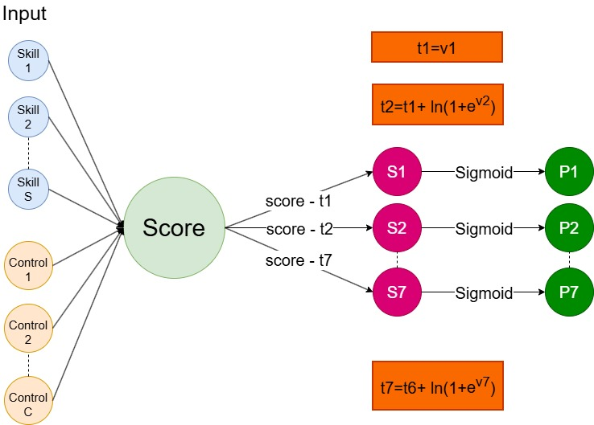

# Skill_Effects_NN
Modeling associations between skill frequencies and target variables in OJAs using feedforward neural networks (NN). Three different models are presented, accounting for consistent modeling of ordinal variables, common continuous variables, and ordinal variables with known boundaries. Associations are summarized after several bootstrap resampling runs (defined by the user).

# Files
## Folder NN_Models
All files train and evaluate single-layer networks that calculate a single score and use it as a basis to provide predictions. 

NN_continuous_time: Trains and evaluates single-layer neural network models by performing bootstrap resampling using a continuous target variable. In our case, it provides direct measurements of associations between skill frequencies and scaled timestamps.

NN_coral_ordinal_regression: Trains and evaluates single-layer neural network models by performing bootstrap resampling using an ordinal target variable. In our case, it provides direct measurements of associations between skill frequencies and education levels. The approach is inspired by Cao et al. (2020).

NN_ordinal_with_bounds: Trains and evaluates single-layer neural network models by performing bootstrap resampling using an ordinal target variable with known boundaries. In our case, it provides direct measurements of associations between skill frequencies and experience and salary levels. Loss is calculated based on the distance between the predicted score and the boundaries of the true values. Example: Predicted Score = 50000 Euros, True Class = 11 , Boundaries of True Class (70000,80000). Distance is either based on the difference between the closest boundary (70000-50000), and the loss is calculated based on either MAE or MSE.

# Scheme
The following scheme corresponds to the model inspired by CORAL ordinal regression (Cao et al., 2020). The score layer is common in the other models as well and is used as a basis to calculate loss and provide predictions.

# References
Cao, W., Mirjalili, V., & Raschka, S. (2020). Rank consistent ordinal regression for neural networks with application to age estimation. Pattern Recognition Letters, 140, 325-331.
